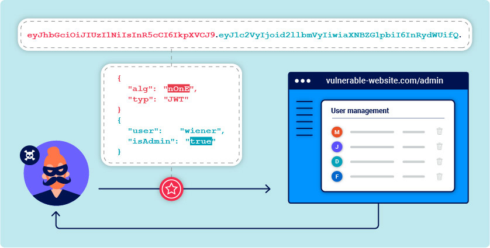

# ATAQUES JWT

En esta sección, veremos cómo los problemas de diseño y el manejo defectuoso de los tokens web JSON (JWT) pueden hacer que los sitios web sean vulnerables a una variedad de ataques de alta gravedad. Dado que los JWT se utilizan con mayor frecuencia en la autenticación, la gestión de sesiones y [los mecanismos de control de acceso ](https://portswigger.net/web-security/access-control), estas vulnerabilidades pueden comprometer potencialmente todo el sitio web y sus usuarios.

<figure><figcaption></figcaption></figure>

### <mark style="color:orange;"></mark>
