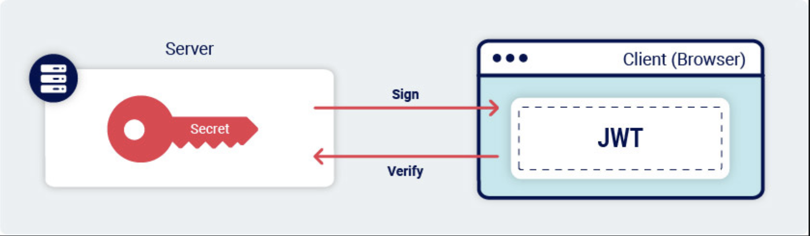

# Confusión de algoritmo

## <mark style="color:orange;">Ataques de confusion del algoritmo JWT</mark>

Incluso si un servidor usa secretos sólidos que usted no puede usar por fuerza bruta, aún puede falsificar JWT válidos firmando el token usando un algoritmo que los desarrolladores no han anticipado. Esto se conoce como un ataque de confusión de algoritmos.


Los ataques de confusión de algoritmos (también conocidos como ataques de confusión de claves) ocurren cuando un atacante puede obligar al servidor a verificar la firma de un token web JSON ([JWT](https://portswigger.net/web-security/jwt)) utilizando un algoritmo diferente al previsto por los desarrolladores del sitio web. Si este caso no se maneja correctamente, esto puede permitir a los atacantes falsificar JWT válidos que contengan valores arbitrarios sin necesidad de conocer la clave de firma secreta del servidor.


## <mark style="color:orange;">Algoritmos simetricos vs asimetricos</mark>

Los JWT se pueden firmar utilizando una variedad de algoritmos diferentes. Algunos de estos, como HS256 (HMAC + SHA-256) usan una clave "simétrica". Esto significa que el servidor usa una sola clave para firmar y verificar el token. Claramente, esto debe mantenerse en secreto, al igual que una contraseña.

<figure><figcaption></figcaption></figure>

Otros algoritmos, como RS256 (RSA + SHA-256) utilizan un par de claves "asimétricas". Este consta de una clave privada, que el servidor usa para firmar el token, y una clave pública matemáticamente relacionada que se puede usar para verificar la firma.

<figure><figcaption></figcaption></figure>

Como sugieren los nombres, la clave privada debe mantenerse en secreto, pero la clave pública a menudo se comparte para que cualquiera pueda verificar la firma de los tokens emitidos por el servidor.


## <mark style="color:orange;">¿Como surgen las vulnerabilidades de confusión de algoritmos?</mark>

Las vulnerabilidades de confusión de algoritmos suelen surgir debido a una implementación defectuosa de las bibliotecas JWT. Aunque el proceso de verificación real difiere según el algoritmo utilizado, muchas bibliotecas proporcionan un único método independiente del algoritmo para verificar las firmas. Estos métodos se basan en la `alg` parámetro en el encabezado del token para determinar el tipo de verificación que deben realizar.

El siguiente pseudocódigo muestra un ejemplo simplificado de lo que es la declaración de este genérico `verify()`El método podría verse como en una biblioteca JWT:

```javascript
function verify(token, secretOrPublicKey){
    algorithm = token.getAlgHeader();
    if(algorithm == "RS256"){
        // Use the provided key as an RSA public key
    } else if (algorithm == "HS256"){
        // Use the provided key as an HMAC secret key
    }
}
```

Los problemas surgen cuando los desarrolladores de sitios web que posteriormente usan este método asumen que manejará exclusivamente JWT firmados usando un algoritmo asimétrico como RS256. Debido a esta suposición errónea, siempre pueden pasar una clave pública fija al método de la siguiente manera:

```javascript
publicKey = <public-key-of-server>;
token = request.getCookie("session");
verify(token, publicKey);
```

En este caso, si el servidor recibe un token firmado con un algoritmo simétrico como HS256, el método genérico de la biblioteca verify() tratará la clave pública como un secreto HMAC. Esto significa que un atacante podría firmar el token usando HS256 y la clave pública, y el servidor usará la misma clave pública para verificar la firma.


La clave pública que utilice para firmar el token debe ser absolutamente idéntica a la clave pública almacenada en el servidor. Esto incluye usar el mismo formato (como X.509 PEM) y conservar los caracteres que no se imprimen, como las líneas nuevas.En la práctica, es posible que deba experimentar con diferentes formatos para que este ataque funcione.



## <mark style="color:orange;">Realizar un ataque de confusion de algoritmo</mark>

Un ataque de confusión de algoritmos generalmente implica los siguientes pasos de alto nivel:

1. [Obtener la clave pública del servidor](https://portswigger.net/web-security/jwt/algorithm-confusion#step-1-obtain-the-server-s-public-key)
2. [Convertir la clave pública a un formato adecuado](https://portswigger.net/web-security/jwt/algorithm-confusion#step-2-convert-the-public-key-to-a-suitable-format)
3. [Cree un JWT malicioso](https://portswigger.net/web-security/jwt/algorithm-confusion#step-3-modify-your-jwt) con una carga útil modificada y el `alg`encabezado establecido en `HS256`.
4. [Firme el token con HS256](https://portswigger.net/web-security/jwt/algorithm-confusion#step-4-sign-the-jwt-using-the-public-key) , utilizando la clave pública como secreto.

En esta sección, analizaremos este proceso con más detalle y demostraremos cómo puede realizar este tipo de ataque con Burp Suite.


#### <mark style="color:orange;">Paso 1 : Obtenga la clave publica del servidor</mark>

Los servidores a veces exponen sus claves públicas como objetos JSON Web Key (JWK) a través de un punto final estándar asignado a /jwks.json o /.well-known/jwks.json, Por ejemplo. Estos pueden almacenarse en una matriz de JWK llamada keys. Esto se conoce como Conjunto JWK.

```javascript
{
    "keys": [
        {
            "kty": "RSA",
            "e": "AQAB",
            "kid": "75d0ef47-af89-47a9-9061-7c02a610d5ab",
            "n": "o-yy1wpYmffgXBxhAUJzHHocCuJolwDqql75ZWuCQ_cb33K2vh9mk6GPM9gNN4Y_qTVX67WhsN3JvaFYw-fhvsWQ"
        },
        {
            "kty": "RSA",
            "e": "AQAB",
            "kid": "d8fDFo-fS9-faS14a9-ASf99sa-7c1Ad5abA",
            "n": "fc3f-yy1wpYmffgXBxhAUJzHql79gNNQ_cb33HocCuJolwDqmk6GPM4Y_qTVX67WhsN3JvaFYw-dfg6DH-asAScw"
        }
    ]
}
```

Incluso si la clave no está expuesta públicamente, es posible que pueda [extraerla de un par de JWT existentes](https://portswigger.net/web-security/jwt/algorithm-confusion#deriving-public-keys-from-existing-tokens).


#### <mark style="color:orange;">Paso 2: Convierte la clave pública a un formato adecuado</mark>

Aunque el servidor puede exponer su clave pública en formato JWK, al verificar la firma de un token, utilizará su propia copia de la clave de su base de datos o sistema de archivos local. Esto puede almacenarse en un formato diferente.

Para que el ataque funcione, la versión de la clave que usa para firmar el JWT debe ser idéntica a la copia local del servidor. Además de tener el mismo formato, todos los bytes deben coincidir, incluidos los caracteres que no se pueden imprimir.

A los efectos de este ejemplo, supongamos que necesitamos la clave en formato PEM X.509.\
Puede convertir un JWK en un PEM usando la [extensión JWT Editor](https://portswigger.net/bappstore/26aaa5ded2f74beea19e2ed8345a93dd) en Burp de la siguiente manera:

1. Con la extensión cargada, en la barra de pestañas principal de Burp, vaya a la **Teclas del editor JWT** pestaña .
2. Haga clic en **Nueva clave RSA** . En el cuadro de diálogo, pegue el JWK que obtuvo anteriormente.
3. Seleccione el **botón de opción PEM** y copie la clave PEM resultante.
4. Vaya a la **pestaña Decodificador** y codifique en Base64 el PEM.
5. Vuelva a la **pestaña JWT Editor Keys** y haga clic en **Nueva clave simétrica** .
6. En el cuadro de diálogo, haga clic en **Generar** para generar una nueva clave en formato JWK.
7. Reemplace el valor generado por el `k`parámetro con una clave PEM codificada en Base64 que acaba de copiar.
8. Guarde la clave.


#### <mark style="color:orange;">Paso 3: modifica tu JWT</mark>

Una vez que tenga la clave pública en un formato adecuado, puede [modificar el JWT ](https://portswigger.net/web-security/jwt/working-with-jwts-in-burp-suite#editing-the-contents-of-jwts)como desee. Sólo asegúrese de que el algel encabezado se establece en HS256.


#### <mark style="color:orange;">Paso 4: firme el JWT con la clave pública</mark>

[Firme el token ](https://portswigger.net/web-security/jwt/working-with-jwts-in-burp-suite#signing-jwts)utilizando el algoritmo HS256 con la clave pública RSA como secreto.
