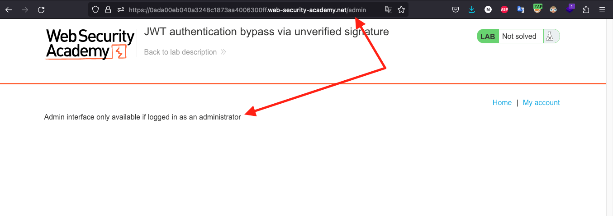
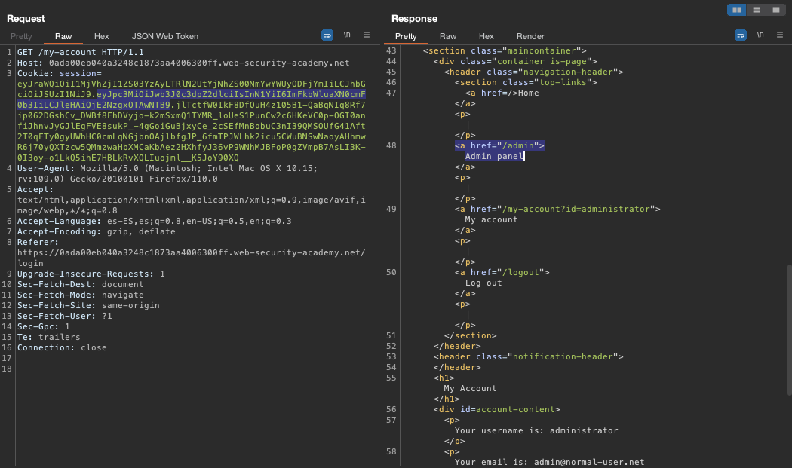

# Lab 1

## <mark style="color:orange;">ANULACION DE AUTENTICACION JWT MEDIANTE FIRMA NO VERIFICADA</mark>

<mark style="color:orange;"></mark>

<mark style="color:red;"></mark>[<mark style="color:red;">https://portswigger.net/web-security/jwt/lab-jwt-authentication-bypass-via-unverified-signature</mark>](https://portswigger.net/web-security/jwt/lab-jwt-authentication-bypass-via-unverified-signature)<mark style="color:red;"></mark>

<mark style="color:orange;"></mark>

Esta práctica de laboratorio usa un mecanismo basado en JWT para manejar sesiones. Debido a fallas de implementación, el servidor no verifica la firma de ningún JWT que recibe. Para resolver el laboratorio, modifique su token de sesión para obtener acceso al panel de administración en `/admin`, luego elimine el usuario `carlos`. Puede iniciar sesión en su propia cuenta con las siguientes credenciales: `wiener:peter.`

1 - Inicio sesión con las credenciales dadas.

<figure><figcaption></figcaption></figure>

2 - Con Burpsuite capturo la petición que se dirige a `my-account` y lo mando a Repeater.

<figure><figcaption></figcaption></figure>

3 - Me fijo el payload del JWT y lo cambio a `admin.`

<figure><figcaption></figcaption></figure>

<figure><figcaption></figcaption></figure>

4 - Envio la solicitud modificada y la respuesta devuelta indica que inicie sesion como Admin

<figure><figcaption></figcaption></figure>

5 - Me dirijo al panel del admin, pero el mensaje me dice que tengo que estar logeado como `administrator`

<figure><figcaption></figcaption></figure>

6 - En el payload cambio de `admin` a `administrator`

<figure><figcaption></figcaption></figure>

7 - Ya logueado como administrator me dirijo al panel /admin

<figure><figcaption></figcaption></figure>

