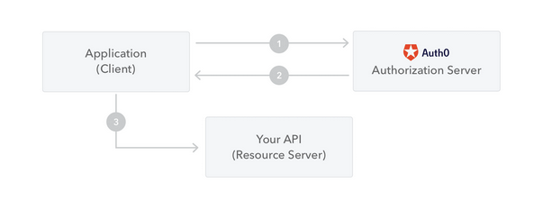

# Introduccion a JWT

## <mark style="color:orange;">¿Que es el JSON Web Token?</mark>

El JSON Web Token (JWT) es un estándar abierto ([RFC 7519](https://tools.ietf.org/html/rfc7519)) que define una forma compacta y autónoma de transmitir información de forma segura entre las partes como un objeto JSON. Esta información se puede verificar y confiar porque está firmada digitalmente. Los JWT se pueden firmar usando un secreto (con el **algoritmo HMAC**) o un par de claves pública/privada usando **RSA** o **ECDSA .**

Aunque los JWT se pueden cifrar para proporcionar también confidencialidad entre las partes, nos centraremos en los _tokens firmados_. Los tokens firmados pueden verificar la _integridad_ de los reclamos contenidos en ellos, mientras que los tokens encriptados _ocultan_ esos reclamos de otras partes. Cuando los tokens se firman utilizando pares de claves pública/privada, la firma también certifica que solo la parte que posee la clave privada es la que la firmó.


## <mark style="color:orange;">¿Cuándo debería usar JSON Web Tokens?</mark>

Estos son algunos escenarios en los que los JSON Web Token son útiles:

* _**Autorización**_ : este es el escenario más común para usar JWT. Una vez que el usuario haya iniciado sesión, cada solicitud posterior incluirá el JWT, lo que permitirá al usuario acceder a rutas, servicios y recursos permitidos con ese token. El inicio de sesión único es una función que se usa ampliamente en JWT en la actualidad, debido a su pequeña sobrecarga y su capacidad para usarse fácilmente en diferentes dominios.
* _**Intercambio de información**_ : los JWT son una buena manera de transmitir información de forma segura entre las partes. Debido a que los JWT se pueden firmar, por ejemplo, utilizando pares de claves pública/privada, puede estar seguro de que los remitentes son quienes dicen ser. Además, como la firma se calcula utilizando el encabezado y la carga útil, también puede verificar que el contenido no haya sido alterado.


## <mark style="color:orange;">¿Qué es la estructura del token web JSON?</mark>

En su forma compacta, los tokens JWT constan de tres partes separadas por puntos ( . ), que son:

* <mark style="color:red;">Encabezamiento</mark>
* <mark style="color:yellow;">Carga útil</mark>
* <mark style="color:green;">Firma</mark>

Por lo tanto, un JWT normalmente tiene el siguiente aspecto.

<mark style="color:red;">`xxxxx`</mark>`.`<mark style="color:yellow;">`yyyyy`</mark>`.`<mark style="color:green;">`zzzzz`</mark>

Vamos a desglosar las diferentes partes.


## <mark style="color:orange;">Header (Encabezado)</mark>

El encabezado _generalmente_ consta de dos partes: el tipo de token, que es JWT, y el algoritmo de firma que se utiliza, como HMAC SHA256 o RSA.

Por ejemplo:

```json
{
  "alg": "HS256",
  "typ": "JWT"
}
```

Luego, este JSON está codificado en Base64Url para formar la primera parte del JWT.


## <mark style="color:orange;">Payload (Carga util)</mark>

La segunda parte del token es la carga útil, que contiene las reclamaciones. Las reclamaciones son declaraciones sobre una entidad (normalmente, el usuario) y datos adicionales. Hay tres tipos de reclamos: _registrados_, _públicos_ y _privados_.

* [**Reclamos registrados**](https://tools.ietf.org/html/rfc7519#section-4.1) : se trata de un conjunto de reclamos predefinidos que no son obligatorios pero se recomiendan para proporcionar un conjunto de reclamos útiles e interoperables. Algunos de ellos son: **`iss`** (emisor), **`exp`** (tiempo de caducidad), **`sub`** (sujeto), **`aud`** (audiencia), entre [otros](https://tools.ietf.org/html/rfc7519#section-4.1) .


Tenga en cuenta que los nombres de los reclamos tienen solo tres caracteres, ya que JWT debe ser compacto.


* [**Reclamos públicos**](https://tools.ietf.org/html/rfc7519#section-4.2) : estos pueden ser definidos a voluntad por aquellos que usan JWT. Pero para evitar colisiones, deben definirse en el [Registro de tokens web JSON de IANA](https://www.iana.org/assignments/jwt/jwt.xhtml) o definirse como un URI que contenga un espacio de nombres resistente a colisiones.
* [**Reclamos privados**](https://tools.ietf.org/html/rfc7519#section-4.3) : Son los reclamos personalizados creados para compartir información entre partes que acuerdan usarlos y no son _reclamos registrados_ ni _reclamos públicos ._ reclamos.

Un ejemplo de Payload podria ser:

```json
{
  "sub": "1234567890",
  "name": "John Doe",
  "admin": true
}
```

Luego, la carga útil se codifica en Base64Url para formar la segunda parte del token web JSON.


Tenga en cuenta que para los tokens firmados esta información, aunque está protegida contra la manipulación, cualquiera puede leerla. No coloque información secreta en la carga útil o en los elementos del encabezado de un JWT a menos que esté encriptada.



## <mark style="color:orange;">Signature (Firma)</mark>

Para crear la parte de la firma, debe tomar el encabezado codificado, la carga útil codificada, un secreto, el algoritmo especificado en el encabezado y firmarlo.

Por ejemplo, si desea utilizar el algoritmo HMAC SHA256, la firma se creará de la siguiente manera:

```
HMACSHA256(
  base64UrlEncode(header) + "." +
  base64UrlEncode(payload),
  secret)
```

La firma se usa para verificar que el mensaje no se modificó en el camino y, en el caso de tokens firmados con una clave privada, también puede verificar que el remitente del JWT es quien dice ser.


## <mark style="color:orange;">Poniendo todo junto</mark>

El resultado son tres cadenas de URL Base64 separadas por puntos que se pueden pasar fácilmente en entornos HTML y HTTP, mientras que son más compactas en comparación con los estándares basados en XML, como SAML.

A continuación, se muestra un JWT que tiene codificados el encabezado y la carga útiles anteriores, y está firmado con un secreto.

<mark style="color:red;">eyJhbGciOiJIUzI1NiIsInR5cCI6IkpXVCJ9</mark>.<mark style="color:yellow;">eyJleHAiOjE2NzgzNjk0MjksImRhdGEiOnsiZW1haWwiOiJwZW50ZXN0aW5nMjAzMkBnbWFpbC5jb20iLCJ1c2VySWQiOiIwN2Y2MjYzZi1mMzNkLTQzZTUtYTNhMS03MjQyNTNhMTcwZWEifSwiaWF0IjoxNjc4MjgzMDI5fQ</mark>.<mark style="color:green;">blyWcb6xchZ3TTqqH2N1C6MKgRXnUrq8-wbM6dpi7J8</mark>

Si quiere jugar con JWT y poner en práctica estos conceptos, puede usar [jwt.io Debugger ](https://jwt.io/#debugger-io)para decodificar, verificar y generar JWT.

<figure><figcaption></figcaption></figure>


## <mark style="color:orange;">¿Cómo funcionan los tokens web JSON?</mark>

En la autenticación, cuando el usuario inicia sesión correctamente con sus credenciales, se devolverá un token web JSON. Dado que los tokens son credenciales, se debe tener mucho cuidado para evitar problemas de seguridad. En general, no debe conservar los tokens más tiempo del necesario.

Tampoco [debe almacenar datos confidenciales de la sesión en el almacenamiento del navegador debido a la falta de seguridad](https://cheatsheetseries.owasp.org/cheatsheets/HTML5\_Security\_Cheat\_Sheet.html#local-storage) .

Cada vez que el usuario desee acceder a una ruta o recurso protegido, el agente de usuario debe enviar el JWT, generalmente en el **encabezado de Autorización** utilizando el **esquema Bearer** .El contenido del encabezado debe ser similar al siguiente:

```
Authorization: Bearer <token>
```

Este puede ser, en ciertos casos, un mecanismo de autorización apátrida. Las rutas protegidas del servidor buscarán un JWT válido en el `Authorization`encabezado, y si está presente, el usuario podrá acceder a los recursos protegidos. Si el JWT contiene los datos necesarios, la necesidad de consultar la base de datos para ciertas operaciones puede reducirse, aunque puede que no siempre sea así.

Tenga en cuenta que si envía tokens JWT a través de encabezados HTTP, debe intentar evitar que crezcan demasiado. Algunos servidores no aceptan más de 8 KB en encabezados. Si está tratando de incrustar demasiada información en un token JWT, como al incluir todos los permisos del usuario, es posible que necesite una solución alternativa, como [Auth0 Fine-Grained Authorization](https://fga.dev/) .

Si el token se envía en el `Authorization`encabezado, el Intercambio de recursos de origen cruzado (CORS) no será un problema ya que no utiliza cookies.

El siguiente diagrama muestra cómo se obtiene y utiliza un JWT para acceder a API o recursos:

<figure><figcaption></figcaption></figure>

1. La aplicación o el cliente solicita autorización al servidor de autorización. Esto se realiza a través de uno de los diferentes flujos de autorización. Por ejemplo,una [aplicación web compatible con OpenID Connect](http://openid.net/connect/) típica pasará por el endpoint `/oauth/authorize`utilizando el [flujo de código de autorización](http://openid.net/specs/openid-connect-core-1\_0.html#CodeFlowAuth).
2. Cuando se otorga la autorización, el servidor de autorización devuelve un token de acceso a la aplicación.
3. La aplicación usa el token de acceso para acceder a un recurso protegido (como una API).

Tenga en cuenta que con los tokens firmados, toda la información contenida en el token está expuesta a los usuarios u otras partes, aunque no puedan cambiarla. Esto significa que no debe poner información secreta dentro del token.


## <mark style="color:orange;">¿Por qué deberíamos usar tokens web JSON?</mark>

Hablemos de los beneficios de **los tokens web JSON (JWT)** en comparación con **los tokens web simples (SWT)** y **los tokens de lenguaje de marcado de aserción de seguridad (SAML)** .

Como JSON es menos detallado que XML, cuando está codificado, su tamaño también es más pequeño, lo que hace que JWT sea más compacto que SAML. Esto hace que JWT sea una buena opción para pasar en entornos HTML y HTTP.

En cuanto a la seguridad, SWT solo puede firmarse simétricamente mediante un secreto compartido utilizando el algoritmo HMAC. Sin embargo, los tokens JWT y SAML pueden usar un par de claves pública/privada en forma de certificado X.509 para la firma. Firmar XML con XML Digital Signature sin introducir oscuros agujeros de seguridad es muy difícil en comparación con la simplicidad de firmar JSON.

Los analizadores JSON son comunes en la mayoría de los lenguajes de programación porque se asignan directamente a los objetos. Por el contrario, XML no tiene un mapeo natural de documento a objeto. Esto hace que sea más fácil trabajar con JWT que con aserciones SAML.

En cuanto al uso, JWT se usa a escala de Internet. Esto destaca la facilidad de procesamiento del lado del cliente del token web JSON en múltiples plataformas, especialmente en dispositivos móviles.

<figure><figcaption><p>Comparación de la longitud de un JWT codificado y un SAML codificado</p></figcaption></figure>
