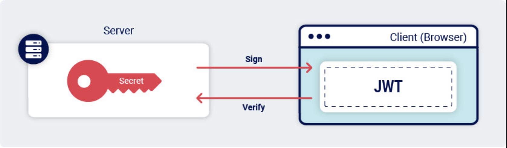

# Lab 2

## <mark style="color:orange;">OMISION DE AUTENTICACION DE JWT A TRAVES DE VERIFICACION DE FIRMA DEFECTUOSA</mark>

<mark style="color:orange;"></mark>



Esta práctica de laboratorio usa un mecanismo basado en JWT para manejar sesiones.El servidor está configurado de forma insegura para aceptar JWT sin firmar.Para resolver el laboratorio, modifique su token de sesión para obtener acceso al panel de administración en `/admin`, luego elimine el usuario `carlos`.Puede iniciar sesión en su propia cuenta con las siguientes credenciales: `wiener:peter`&#x20;

1 - Inicio sesión con las credenciales dadas.

<figure><figcaption></figcaption></figure>

2 - Con Burpsuite capturo el Request y lo envio al Repeater.

<figure><figcaption></figcaption></figure>

3 - En el Repeater de Burpsuite modifico el endpoint `/my-account` a `/admin` . En el payload del JWT cambio `wiener` por `administrator`. Ademas cambio en el encabezado del JWT el `alg` a `none`. Por ultimo, elimino la firma, sin sacar el punto que queda luego del payload.

<figure><figcaption></figcaption></figure>

<figure><figcaption></figcaption></figure>

<figure><figcaption></figcaption></figure>

4 - Hechos estos cambios, accedo a la url admin. Desde alli, procedo a eliminar al usuario Carlos.

<figure><figcaption></figcaption></figure>
