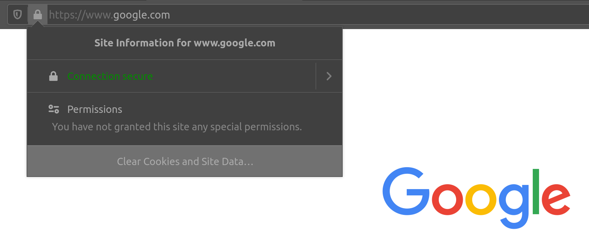

# HTTP

## <mark style="color:orange;">HyperText Transfer Protocol (HTTP)</mark>

Hoy en día, la mayoría de las aplicaciones que utilizamos interactúan constantemente con Internet, tanto web como aplicaciones móviles. La mayoría de las comunicaciones por Internet se realizan con solicitudes web a través del protocolo HTTP.  [HTTP ](https://tools.ietf.org/html/rfc2616)es un protocolo de nivel de aplicación utilizado para acceder a los recursos de la World Wide Web. El término `hypertext`significa texto que contiene enlaces a otros recursos y texto que los lectores pueden interpretar fácilmente.

La comunicación HTTP consta de un cliente y un servidor, donde el cliente solicita al servidor un recurso. El servidor procesa las solicitudes y devuelve el recurso solicitado. El puerto predeterminado para la comunicación HTTP es puerto `80`, aunque esto se puede cambiar a cualquier otro puerto, según la configuración del servidor web. Las mismas solicitudes se utilizan cuando usamos Internet para visitar diferentes sitios web. Entramos en un `Fully Qualified Domain Name` ( `FQDN`) como un `Uniform Resource Locator` ( `URL`) para llegar al sitio web deseado, como [www.hackthebox.com ](http://www.hackthebox.com).

## <mark style="color:orange;">URL</mark>

Se accede a los recursos a través de HTTP a través de un `URL`, que ofrece muchas más especificaciones que simplemente especificar un sitio web que queremos visitar. Veamos la estructura de una URL:

<figure><figcaption></figcaption></figure>

Esto es lo que significa cada componente:

| **Componente** | **Ejemplo**          | **Descripción**                                                                                                                                                                                                 |
| -------------- | -------------------- | --------------------------------------------------------------------------------------------------------------------------------------------------------------------------------------------------------------- |
| `Scheme`       | `http://` `https://` | Se utiliza para identificar el protocolo al que accede el cliente y termina con dos puntos y una doble barra ( `://`)                                                                                           |
| `User Info`    | `admin:password@`    | Este es un componente opcional que contiene las credenciales (separadas por dos puntos `:`) se utiliza para autenticarse en el host y se separa del host con un signo de arroba ( `@`)                          |
| `Host`         | `inlanefreight.com`  | El anfitrión significa la ubicación del recurso. Puede ser un nombre de host o una dirección IP                                                                                                                 |
| `Port`         | `:80`                | los `Port`se separa de la `Host`por dos puntos ( `:`). Si no se especifica ningún puerto, `http`esquemas predeterminados para puerto `80`y `https`puerto predeterminado `443`                                   |
| `Path`         | `/dashboard.php`     | Esto apunta al recurso al que se accede, que puede ser un archivo o una carpeta. Si no se especifica una ruta, el servidor devuelve el índice predeterminado (p. ej. `index.html`).                             |
| `Query String` | `?login=true`        | La cadena de consulta comienza con un signo de interrogación ( `?`), y consta de un parámetro (p. ej. `login`) y un valor (p. ej. `true`). Múltiples parámetros pueden estar separados por un ampersand ( `&`). |
| `Fragments`    | `#status`            | Los navegadores procesan los fragmentos en el lado del cliente para ubicar secciones dentro del recurso principal (por ejemplo, un encabezado o sección en la página).                                          |
