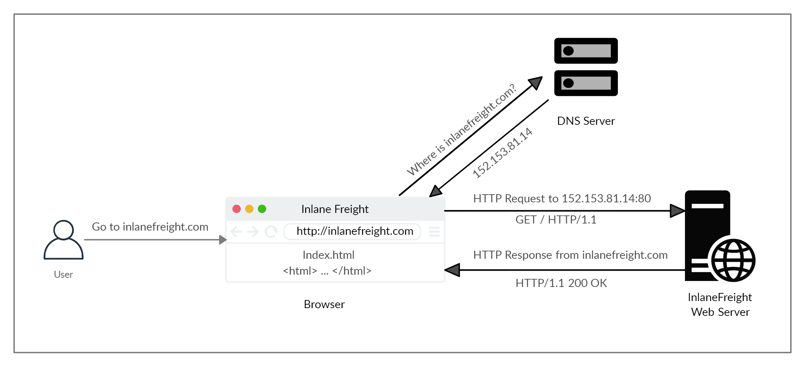

# HTTP

## <mark style="color:blue;">HyperText Transfer Protocol (HTTP)</mark>

Hoy en día, la mayoría de las aplicaciones que utilizamos interactúan constantemente con Internet, tanto web como aplicaciones móviles. La mayoría de las comunicaciones por Internet se realizan con solicitudes web a través del protocolo HTTP.  [HTTP ](https://tools.ietf.org/html/rfc2616)es un protocolo de nivel de aplicación utilizado para acceder a los recursos de la World Wide Web. El término `hypertext`significa texto que contiene enlaces a otros recursos y texto que los lectores pueden interpretar fácilmente.

La comunicación HTTP consta de un cliente y un servidor, donde el cliente solicita al servidor un recurso. El servidor procesa las solicitudes y devuelve el recurso solicitado. El puerto predeterminado para la comunicación HTTP es puerto `80`, aunque esto se puede cambiar a cualquier otro puerto, según la configuración del servidor web. Las mismas solicitudes se utilizan cuando usamos Internet para visitar diferentes sitios web. Entramos en un `Fully Qualified Domain Name` ( `FQDN`) como un `Uniform Resource Locator` ( `URL`) para llegar al sitio web deseado, como [www.hackthebox.com ](http://www.hackthebox.com).

## <mark style="color:blue;">URL</mark>

Se accede a los recursos a través de HTTP a través de un `URL`, que ofrece muchas más especificaciones que simplemente especificar un sitio web que queremos visitar. Veamos la estructura de una URL:

<figure><figcaption></figcaption></figure>

Esto es lo que significa cada componente:

| **Componente** | **Ejemplo**          | **Descripción**                                                                                                                                                                                                 |
| -------------- | -------------------- | --------------------------------------------------------------------------------------------------------------------------------------------------------------------------------------------------------------- |
| `Scheme`       | `http://` `https://` | Se utiliza para identificar el protocolo al que accede el cliente y termina con dos puntos y una doble barra ( `://`)                                                                                           |
| `User Info`    | `admin:password@`    | Este es un componente opcional que contiene las credenciales (separadas por dos puntos `:`) se utiliza para autenticarse en el host y se separa del host con un signo de arroba ( `@`)                          |
| `Host`         | `inlanefreight.com`  | El anfitrión significa la ubicación del recurso. Puede ser un nombre de host o una dirección IP                                                                                                                 |
| `Port`         | `:80`                | Los `Port`se separa de la `Host`por dos puntos ( `:`). Si no se especifica ningún puerto,el esquema `http` es el predeterminado para el puerto `80`y `https`  para el puerto predeterminado `443`               |
| `Path`         | `/dashboard.php`     | Esto apunta al recurso al que se accede, que puede ser un archivo o una carpeta. Si no se especifica una ruta, el servidor devuelve el índice predeterminado (p. ej. `index.html`).                             |
| `Query String` | `?login=true`        | La cadena de consulta comienza con un signo de interrogación ( `?`), y consta de un parámetro (p. ej. `login`) y un valor (p. ej. `true`). Múltiples parámetros pueden estar separados por un ampersand ( `&`). |
| `Fragments`    | `#status`            | Los navegadores procesan los fragmentos en el lado del cliente para ubicar secciones dentro del recurso principal (por ejemplo, un encabezado o sección en la página).                                          |

No todos los componentes son necesarios para acceder a un recurso. Los principales campos obligatorios son el esquema y el host, sin los cuales la solicitud no tendría recurso para solicitar.

## <mark style="color:blue;">Flujo HTTP</mark>

<figure><figcaption></figcaption></figure>

El diagrama anterior presenta la anatomía de una solicitud HTTP a un nivel muy alto. La primera vez que un usuario ingresa la URL ( `inlanefreight.com`) en el navegador, envía una solicitud a un servidor DNS (Resolución de nombres de dominio) para resolver el dominio y obtener su IP. El servidor DNS busca la dirección IP para `inlanefreight.com`y lo devuelve. Todos los nombres de dominio deben resolverse de esta manera, ya que un servidor no puede comunicarse sin una dirección IP.


Nuestros navegadores normalmente buscan primero los registros en el local '`/etc/hosts`',  y si el dominio solicitado no existe dentro de él, entonces contactarían con otros servidores DNS. Podemos usar el ' /`etc/hosts`' para agregar manualmente registros para la resolución de DNS, agregando la IP seguida del nombre de dominio.


Una vez que el navegador obtiene la dirección IP vinculada al dominio solicitado, envía una solicitud GET al puerto HTTP predeterminado (p. ej. `80`), preguntando por la raíz `/`sendero. Luego, el servidor web recibe la solicitud y la procesa. De forma predeterminada, los servidores están configurados para devolver un archivo de índice cuando una solicitud de `/` es recibida.

En este caso, el contenido de `index.html` es leída y devuelta por el servidor web como una respuesta HTTP. La respuesta también contiene el código de estado (p. ej. `200 OK`), lo que indica que la solicitud se procesó correctamente. A continuación, el navegador web representa el `index.html` y lo presenta al usuario.


Este módulo se centra principalmente en las solicitudes web HTTP. Para obtener más información sobre HTML y aplicaciones web, puede consultar el [Introducción a las aplicaciones web . ](https://academy.hackthebox.com/module/details/75)módulo


## <mark style="color:blue;">cURL</mark>

En este módulo, enviaremos solicitudes web a través de dos de las herramientas más importantes para cualquier probador de penetración web, un navegador web, como Chrome o Firefox, y el cURL herramienta de línea de comandos.

