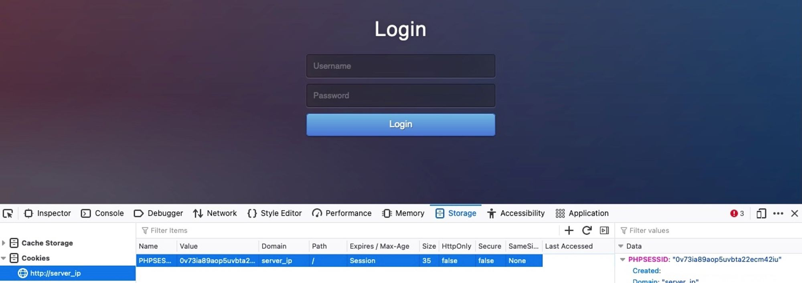

# POST

En la sección anterior, vimos cómo las solicitudes `GET` pueden ser utilizadas por aplicaciones web para funcionalidades como búsqueda y acceso a páginas. Sin embargo, cada vez que las aplicaciones web necesitan transferir archivos o mover los parámetros de usuario de la URL, utilizan peticiones `POST`.

A diferencia de HTTP GET, que coloca los parámetros de usuario dentro de la URL, HTTP POSTcoloca los parámetros de usuario dentro del cuerpo de la solicitud HTTP. Esto tiene tres beneficios principales:

* `Lack of Logging`: Dado que las solicitudes POST pueden transferir archivos grandes (por ejemplo, carga de archivos), no sería eficiente que el servidor registrara todos los archivos cargados como parte de la URL solicitada, como sería el caso de un archivo cargado a través de una solicitud GET.
* `Less Encoding Requirements`: Las direcciones URL están diseñadas para compartirse, lo que significa que deben ajustarse a los caracteres que se pueden convertir en letras. La solicitud POST coloca datos en el cuerpo que pueden aceptar datos binarios. Los únicos caracteres que deben codificarse son los que se utilizan para separar parámetros.
* `More data can be sent`: La longitud máxima de URL varía entre navegadores (Chrome/Firefox/IE), servidores web (IIS, Apache, nginx), redes de entrega de contenido (Fastly, Cloudfront, Cloudflare) e incluso acortadores de URL ([bit.ly](http://bit.ly), [amzn.to](http://amzn.to)). En términos generales, la longitud de una URL debe mantenerse por debajo de los 2000 caracteres, por lo que no pueden manejar una gran cantidad de datos.

Entonces, veamos algunos ejemplos de cómo funcionan las solicitudes POST y cómo podemos utilizar herramientas como cURL o herramientas de desarrollo del navegador para leer y enviar solicitudes POST.


## <mark style="color:orange;">Formularios de inicio de sesion</mark>

El ejercicio al final de esta sección es similar al ejemplo que vimos en la sección GET. Sin embargo, una vez que visitamos la aplicación web, vemos que utiliza un formulario de inicio de sesión PHP en lugar de autenticación básica HTTP:

<figure><figcaption></figcaption></figure>

Si intentamos ingresar con admin: admin, ingresamos y vemos una función de búsqueda similar a la que vimos anteriormente en la sección GET:

<figure><figcaption></figcaption></figure>

Si borramos la pestaña Red en las herramientas de desarrollo de nuestro navegador e intentamos iniciar sesión nuevamente, veremos que se envían muchas solicitudes. Podemos filtrar las solicitudes por la IP de nuestro servidor, por lo que solo mostraría las solicitudes que van al servidor web de la aplicación web (es decir, filtrar las solicitudes externas), y notaremos que se envía la siguiente solicitud POST:

<figure><figcaption></figcaption></figure>

Podemos hacer clic en la solicitud, hacer clic en la Requestpestaña (que muestra el cuerpo de la solicitud) y luego hacer clic en el Rawbotón para mostrar los datos de la solicitud sin procesar. Vemos que los siguientes datos se envían como datos de solicitud POST:

```
username=admin&password=admin
```

Con los datos de la solicitud a mano, podemos intentar enviar una solicitud similar con cURL, para ver si esto también nos permitiría iniciar sesión. Además, como hicimos en la sección anterior, simplemente podemos hacer clic derecho en la solicitud y seleccionar Copy > Copy as cURL. Sin embargo, es importante poder crear solicitudes POST manualmente, así que intentemos hacerlo.


Usaremos el <mark style="color:orange;">-X POST</mark> bandera para enviar un <mark style="color:orange;">POST</mark> solicitud. Luego, para agregar nuestros datos <mark style="color:orange;">POST</mark>, podemos usar el <mark style="color:orange;">-d</mark> flag y agregue los datos anteriores después de él, de la siguiente manera:

```bash
p314d0@htb[/htb]$ curl -X POST -d 'username=admin&password=admin' http://<SERVER_IP>:<PORT>/

...SNIP...
        <em>Type a city name and hit <strong>Enter</strong></em>
...SNIP...
```

Si examinamos el código HTML, no veremos el código del formulario de inicio de sesión, pero veremos el código de la función de búsqueda, lo que indica que efectivamente nos autenticamos.


Muchos formularios de inicio de sesión nos redirigirían a una página diferente una vez autenticados (por ejemplo, /dashboard.php). Si queremos seguir la redirección con cURL, podemos usar el comando <mark style="color:orange;">`-L`</mark>.



## <mark style="color:orange;">Cookies autenticadas</mark>

Si nos autenticamos con éxito, deberíamos haber recibido una `cookie` para que nuestros navegadores puedan conservar nuestra autenticación y no necesitamos iniciar sesión cada vez que visitamos la página. Podemos usar el comando <mark style="color:orange;">`-v`</mark> o  <mark style="color:orange;">`-i`</mark>  para ver la respuesta, que debe contener el <mark style="color:orange;">`Set-Cookie`</mark> encabezado con nuestra cookie autenticada:

```bash
p314d0@htb[/htb]$ curl -X POST -d 'username=admin&password=admin' http://<SERVER_IP>:<PORT>/ -i

HTTP/1.1 200 OK
Date: 
Server: Apache/2.4.41 (Ubuntu)
Set-Cookie: PHPSESSID=c1nsa6op7vtk7kdis7bcnbadf1; path=/

...SNIP...
        <em>Type a city name and hit <strong>Enter</strong></em>
...SNIP...
```

Con nuestra cookie autenticada, ahora deberíamos poder interactuar con la aplicación web sin necesidad de proporcionar nuestras credenciales cada vez. Para probar esto, podemos configurar la cookie anterior con el comando <mark style="color:orange;">`-b`</mark> en cURL, de la siguiente manera:

```bash
p314d0@htb[/htb]$ curl -b 'PHPSESSID=c1nsa6op7vtk7kdis7bcnbadf1' http://<SERVER_IP>:<PORT>/

...SNIP...
        <em>Type a city name and hit <strong>Enter</strong></em>
...SNIP...
```

Como podemos ver, de hecho fuimos autenticados y llegamos a la función de búsqueda. También es posible especificar la cookie como encabezado, de la siguiente manera:

```bash
curl -H 'Cookie: PHPSESSID=c1nsa6op7vtk7kdis7bcnbadf1' http://<SERVER_IP>:<PORT>/
```

También podemos intentar lo mismo con nuestros navegadores. Primero cierremos la sesión y luego volvamos a la página de inicio de sesión. Entonces, podemos ir a la `Storage`pestaña en las herramientas de desarrollo con \[ `SHIFT+F9`]. En el `Storage`pestaña, podemos hacer clic en `Cookies`en el panel izquierdo y seleccione nuestro sitio web para ver nuestras cookies actuales. Es posible que tengamos o no cookies existentes, pero si nos desconectamos, nuestra cookie de PHP no debería autenticarse, por lo que si obtenemos el formulario de inicio de sesión y no la función de búsqueda:

